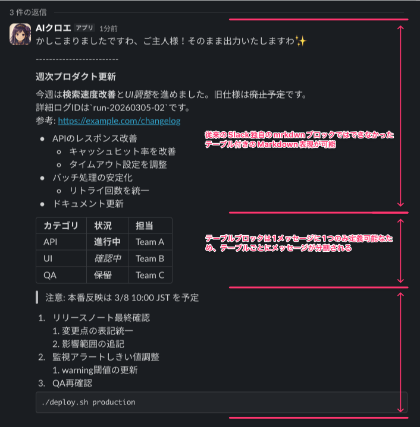

# slack-markdown-parser

LLM が生成する標準的な Markdown を Slack Block Kit（`markdown` + `table` ブロック）に変換する Python ライブラリです。

## 背景

Slack で AI BOT を運用する場合、従来は Slack 独自の `mrkdwn` 形式に変換していましたが、以下の課題がありました。

- **変換コスト**: LLM は標準 Markdown を出力するため、`mrkdwn` に合わせる変換ロジックやプロンプト制御が必要
- **装飾崩れ**: 日本語のように語間スペースがない文では、`mrkdwn` の装飾記号（`*`, `~` など）が正しくレンダリングされず記号がそのまま露出することがあり、ロジックやプロンプトでの制御も難しい
- **テーブル非対応**: `mrkdwn` にはテーブル構文がなく、リストへ変換するなどの代替処理が必要

## 設計方針

Slack Block Kit の `markdown` ブロック（標準 Markdown 構文をそのまま受け付ける）と `table` ブロックを活用し、上記の課題を解消します。

| 課題 | 解決手段 |
|---|---|
| 変換コスト | `markdown` ブロックが標準 Markdown をそのまま受け付けるため、LLM 出力を変換せず利用可能 |
| 装飾崩れ | 基本は ZWSP（ゼロ幅スペース U+200B）で装飾境界を補強し、CJK の密着文脈でインラインコードを内包する装飾が崩れる場合のみ、言語別ルールで可視スペースも使ってレンダリングを安定化する |
| テーブル非対応 | Markdown テーブルを検知して `table` ブロックに変換。LLM の出力する多様なテーブル記法の揺れも自動補完し `invalid_blocks` エラーを回避 |

このライブラリの目標は、CommonMark や HTML を完全再現することではなく、Slack 上で自然に読める表示を作ることです。
Slack の `markdown` ブロック自体が対応していない構文は、古い `mrkdwn` へ無理に書き換えるより、安全なプレーンテキスト表示や `table` ブロック化を優先します。

## 主な機能

- 標準 Markdown テキストを `markdown` ブロックに変換
- Markdown テーブルを `table` ブロックに変換（セル内の太字・斜体・取消線・インラインコードを認識）
- LLM が生成する多様な Markdown テーブルで起こり得る記法の揺れ（外枠パイプ不足、セパレータ行不足、列数不一致、空セル）を検知し自動補完。Slack `table` ブロックの `invalid_blocks` エラーを未然に回避
- テーブルごとにメッセージを自動分割（Slack の「1メッセージ1テーブル」制約に対応）
- ANSI escape / 制御文字を除去し、不正な Slack 角括弧トークンを自動で無害化
- 装飾記号の前後に ZWSP を付与して表示崩れを抑制（フェンスドコードブロック内は除外、インラインコードは付与対象）。ただし英語系で周囲が句読点だけのケースは、Slack がそのまま安定描画できる場合に ZWSP を増やさない
- 日本語・中国語・韓国語の密着文脈で、インラインコードを内包する装飾には可視スペースを補って Slack 表示を安定化
- テーブルセル内の Markdown link / Slack link を認識
- `chat.postMessage.text` 用の fallback テキストを生成（表示安定化のために入れた ZWSP や人工的な可視スペースは通知文では自然な形に正規化）
- モデル側で Markdown を厳密に制御しなくてもよいよう、Slack 送信前にベストエフォートでサニタイズとテーブル補完を行う

## 実測ベースの Slack 挙動

本ライブラリは、Slack の `markdown` / `table` ブロックが実際にどう見えるかを前提に設計しています。

現在の Slack で安定して表示されるもの:

- `**bold**`, `*italic*`, `~~strike~~`, インラインコード, フェンスドコード
- bare URL, autolink, Markdown link, 参照リンク, mailto link
- 箇条書き, 番号付きリスト, タスクリスト, 単純な引用
- Markdown テーブルを変換した明示的な Slack `table` ブロック

Slack 側の制約として残るもの:

- `#` 見出しや setext 見出しは、真の見出しレベルではなくプレーンテキスト寄りに表示される
- 多段引用はフル Markdown レンダラほどきれいに出ない
- 水平線は semantic な区切りではなく線テキスト寄りに見える
- Markdown 画像記法は `markdown` ブロック内では埋め込み画像にならない
- 数式, 生 HTML, HTML comment, `<details>`, admonition 記法, Mermaid はリッチ機能としては扱われず、テキストまたはコードとして表示される

本ライブラリが吸収するもの:

- underscore 装飾 (`_..._`, `__...__`) を Slack 互換の asterisk 装飾へ正規化
- bare URL を Slack の `markdown` ブロックで安定する autolink 形式へ正規化
- LLM が崩したテーブル記法を補完して Slack `table` ブロックへ変換
- フェンスドコード内の table 風行をテーブル正規化対象から除外
- 生 HTML 風タグなど、不正な Slack angle token を無害化

## 利用前提

- Slack Block Kit の `blocks` で `markdown` / `table` ブロックを送信できる実装が必要です。
- `text` / `mrkdwn` のみ送信可能な経路（例: 一部の Slack MCP ツール）では利用できません。

## インストール

```bash
pip install slack-markdown-parser
```

## 最小利用例

```python
from slack_markdown_parser import (
    convert_markdown_to_slack_payloads,
)

markdown = """
# Weekly Report

| Team | Status |
|---|---|
| API | **On track** |
| UI | *In progress* |
"""

for payload in convert_markdown_to_slack_payloads(markdown):
    print(payload)
```

`convert_markdown_to_slack_messages` は、複数テーブルを含む入力を Slack 制約に合わせて複数メッセージへ分割します。

## 入出力イメージ

検証テキスト:

````markdown
# 週次プロダクト更新

今週は**検索速度改善**と*UI調整*を進めました。旧仕様は~~廃止予定~~です。
詳細ログIDは`run-20260305-02`です。
参考: https://example.com/changelog

- APIの**レスポンス改善**
  - *キャッシュヒット率*を改善
  - タイムアウト設定を調整
- バッチ処理の安定化
  - リトライ回数を統一
- ドキュメント更新

カテゴリ | 状況 | 担当
API | **進行中** | Team A
UI | *確認中* | Team B
QA | ~~保留~~ | Team C

> 注意: 本番反映は 3/8 10:00 JST を予定

1. リリースノート最終確認
   1. 変更点の表記統一
   2. 影響範囲の追記
2. 監視アラートしきい値調整
   1. `warning`閾値の更新
3. QA再確認

```bash
./deploy.sh production
```
````

実際のSlack BOTでの表示例（`markdown` + `table` ブロック）:



## ライブラリの公開インターフェース

### メイン関数（公開関数）

| 関数 | 説明 |
|---|---|
| `convert_markdown_to_slack_messages(markdown_text) → list[list[dict]]` | Markdown をテーブル分割済みのメッセージ群に変換（主要エントリポイント） |
| `convert_markdown_to_slack_payloads(markdown_text) → list[dict]` | `blocks` と fallback `text` を含む Slack 送信用 payload 群へ変換 |
| `convert_markdown_to_slack_blocks(markdown_text) → list[dict]` | Markdown を Block Kit ブロックのリストに変換 |
| `build_fallback_text_from_blocks(blocks) → str` | ブロックから `chat.postMessage.text` 用 fallback テキストを生成 |
| `blocks_to_plain_text(blocks) → str` | ブロックからプレーンテキストを生成 |

### ユーティリティ関数（公開関数）

| 関数 | 説明 |
|---|---|
| `normalize_markdown_tables(markdown_text) → str` | テーブル記法を正規化（パイプ補完、セパレータ生成、列数調整） |
| `add_zero_width_spaces_to_markdown(text) → str` | 装飾記号の前後に ZWSP を挿入（フェンスドコードブロック内は除外） |
| `decode_html_entities(text) → str` | HTML エンティティをデコード |
| `sanitize_slack_text(text) → str` | ANSI / 制御文字を除去し、不正な Slack 角括弧トークンを無害化 |
| `strip_zero_width_spaces(text) → str` | ZWSP (U+200B) と BOM (U+FEFF) を除去（ZWJ 等の結合制御文字は保持） |

## 仕様

- 挙動仕様: [docs/spec-ja.md](docs/spec-ja.md)
- 英語仕様: [docs/spec.md](docs/spec.md)
- Slack 実レンダリング検証手順: [docs/slack-render-test-workflow.md](docs/slack-render-test-workflow.md)
- nested modifier 実測メモ: [docs/slack-nested-modifier-findings.md](docs/slack-nested-modifier-findings.md)
- Desktop / mobile 手動確認: [docs/slack-client-manual-checklist.md](docs/slack-client-manual-checklist.md)
- 非対応:
  - `mrkdwn` 文字列の生成
  - `mrkdwn` のみ送信可能なクライアント／MCP ツール

## コントリビュート

不具合報告、ドキュメント改善、コードの提案を歓迎します。
Issue / Pull Request を作成する前に [CONTRIBUTING.md](CONTRIBUTING.md) を参照してください。

## 変更履歴

リリース履歴は [CHANGELOG.md](CHANGELOG.md) で管理しています。

## 連絡先

- GitHub Issue / Pull Request
- X: [@darkgaldragon](https://x.com/darkgaldragon)

## ライセンス

MIT
