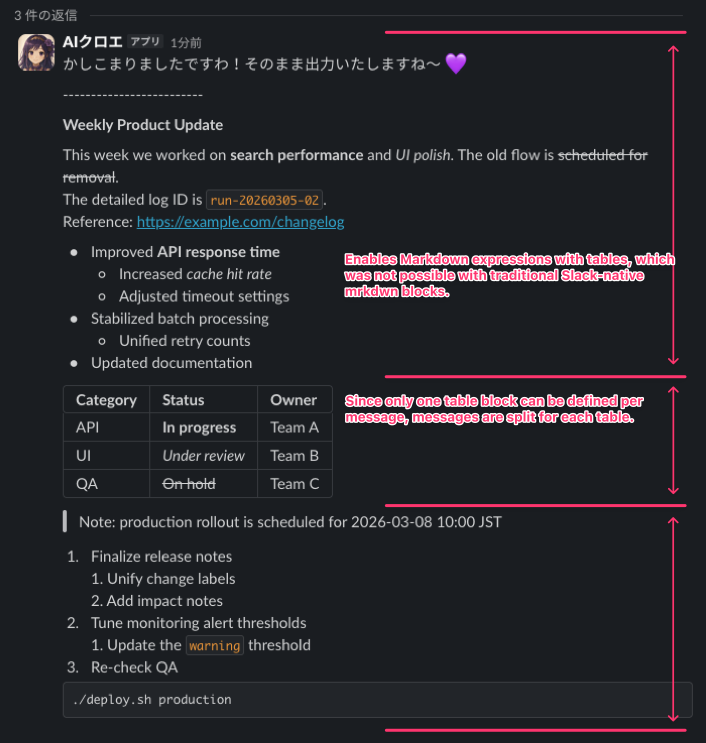

# slack-markdown-parser

`slack-markdown-parser` is a Python library that converts general Markdown generated by LLMs into Slack Block Kit messages built from `markdown`, `table`, and selected richer blocks so the output renders cleanly in Slack.
Basic headings, lists, and text formatting stay in `markdown` blocks, while constructs that tend to break in Slack, such as tables, are converted into dedicated Block Kit blocks to produce a ChatGPT-like reading experience.

## Why this library exists

Many Slack AI bots have traditionally converted model output into Slack-specific `mrkdwn`, but that approach creates a few recurring problems:

- Extra conversion work: LLMs naturally generate ordinary Markdown, so `mrkdwn` usually needs extra conversion logic or stricter prompts.
- Unstable formatting in languages without spaces between words: in Japanese, Chinese, Korean, and similar writing systems, Slack can fail to interpret `*`, `~`, and related markers correctly, exposing the raw punctuation.
- No table syntax in `mrkdwn`: if you stay in the old format, Markdown tables need custom table rendering.

## Design approach

This library combines Slack Block Kit's newer `markdown` block, `table` blocks, and richer block conversion for Markdown patterns that can be mapped safely.

| Problem | Approach |
|---|---|
| Extra conversion work | Slack `markdown` blocks can render a useful subset of Markdown other than tables, so LLM output can usually be sent with minimal rewriting instead of being converted into `mrkdwn`. |
| Formatting instability | Slack's `markdown` parser is not complete, so this library adds zero-width spaces (`U+200B`) around formatting-marker boundaries and uses visible spaces only for a few Japanese, Chinese, and Korean cases where that is still needed. This keeps emphasis stable across English and dense CJK text. |
| No table syntax in `mrkdwn` | Detect Markdown tables and render them as Slack `table` blocks, while also repairing common LLM-generated table issues such as missing pipes. |
| Rich LLM output | Convert standalone images, dividers, simple quotes, code fences, and simple lists into native Block Kit blocks where the Markdown structure is unambiguous. |

The goal is natural rendering on Slack without exposing raw formatting markers, not full CommonMark or HTML fidelity.
If Slack itself does not support a construct in `markdown` blocks, this library prefers safe plain-text rendering or explicit `table` blocks over aggressive rewrites into old `mrkdwn`.

## Features

- Convert general Markdown into Slack `markdown` blocks
- Convert Markdown tables into Slack `table` blocks
- Promote safe standalone Markdown constructs into richer Block Kit blocks: `image`, `divider`, and `rich_text`
- Repair common LLM table issues such as missing outer pipes, missing separator rows, mismatched column counts, and empty cells
- Split output into multiple Slack messages when needed to satisfy Slack's "one table per message" constraint
- Remove ANSI/control characters and neutralize invalid Slack angle-bracket tokens before block generation
- Add zero-width spaces around inline formatting markers to reduce rendering issues outside fenced code blocks, while preserving English-like punctuation-only boundaries that Slack already renders reliably
- Add visible spaces for a small set of nested inline-code cases in dense Japanese, Chinese, and Korean text when zero-width spaces alone are not enough
- Support Markdown links and Slack-style links inside table cells
- Optionally keep blank lines visible inside Slack `markdown` blocks by inserting placeholder lines, while keeping preview text unchanged
- Build preview text for `chat.postMessage.text` from generated blocks, removing the invisible or temporary spacing that was added only to stabilize Slack rendering
- Accept raw LLM Markdown without tightly constraining the model prompt, using best-effort sanitize and table repair before Slack delivery

## How Slack behaved in testing

The library is built around how Slack actually renders `markdown` and `table` blocks in practice.

Slack updated its [`markdown` block docs](https://docs.slack.dev/reference/block-kit/blocks/markdown-block/)
and [changelog entry](https://docs.slack.dev/changelog/2026/03/06/block-kit-rich-text)
on March 6, 2026 as it started supporting broader Markdown features such as headings, dividers, task lists,
native Markdown tables, and syntax-highlighted code blocks. In the Slack Web
workspace used for this project's April 8, 2026 validation, raw `markdown`
blocks rendered those constructs natively, including distinct heading levels
for `#`, `##`, `###`, and setext headings.

Slack still controls the exact release timing and visual style of those newer
features. Treat newer raw Markdown rendering as behavior controlled by Slack,
not by this library, and verify it in your own workspace, client, and posting
path.

Reliable in current Slack rendering:

- `**bold**`, `*italic*`, `~~strike~~`, inline code, and fenced code blocks
- Bare URLs, `<https://...>` style links, Markdown links, reference-style links, and mailto links
- Bullet lists, ordered lists, task lists, and simple blockquotes
- Explicit Slack `table` blocks generated from Markdown tables
- Explicit richer blocks generated from unambiguous Markdown, such as standalone images, code fences, simple lists, and simple quotes
- In environments where Slack has enabled the newer renderer, raw Markdown headings, dividers, and tables inside `markdown` blocks

Known Slack-side limitations:

- Exact heading sizes and some newer raw Markdown features still depend on the Slack app, workspace, and release state
- Paragraph breaks inside `markdown` blocks currently get little or no extra vertical spacing in tested Slack Web clients, so blank lines can look visually collapsed
- Nested blockquotes are weaker than in full Markdown renderers
- Raw Markdown tables inside `markdown` blocks now render in some newer Slack environments, but explicit Slack `table` blocks remain the reliable option across workspaces and delivery paths
- Markdown image syntax does not become an embedded image in `markdown` blocks
- Math, raw HTML, HTML comments, `<details>`, admonition syntax, and Mermaid are rendered as plain text or code, not as rich features
- Some newly documented Block Kit block types can be unavailable on a given `chat.postMessage` path; this library emits only a conservative subset of richer block types that has been validated through real Slack posting checks.
- The Slack **mobile** app re-prefixes the list marker onto each continuation line of a list item inside `markdown` blocks (e.g. `1. Heading` followed by an indented paragraph shows as `1. Heading` / `1.continuation` on mobile, while Slack desktop and Slack Web render the same payload correctly). This is a Slack client-side rendering behavior, not a parser bug. Tracking: [issue #45](https://github.com/darkgaldragon/slack-markdown-parser/issues/45).

What this library compensates for:

- Normalizes underscore emphasis (`_..._`, `__...__`) into Slack-friendly asterisk emphasis
- Wraps bare URLs into Slack-friendly `<https://...>` link form before sending `markdown` blocks
- Repairs malformed LLM-generated tables before converting them into Slack `table` blocks
- Converts unambiguous standalone Markdown constructs into native Block Kit blocks when that is safer than relying on raw `markdown` rendering
- Keeps table-like rows inside fenced code blocks out of table normalization
- Optionally turns internal blank lines into placeholder lines that keep paragraphs visibly separated in Slack `markdown` blocks
- Neutralizes invalid Slack angle-bracket tokens such as raw HTML-like tags

## Requirements

- Your Slack integration must support Block Kit payloads with `markdown`, `table`, and the richer blocks emitted by this library (`rich_text`, `image`, and `divider`).
- This library does not help when your delivery path only accepts plain `text` or `mrkdwn` strings.

## Installation

```bash
pip install slack-markdown-parser
```

## Quick start

```python
from slack_markdown_parser import (
    convert_markdown_to_slack_payloads,
)

markdown = """
# Weekly Report

| Team | Status |
|---|---|
| API | **On track** |
| UI | *In progress* |
"""

for payload in convert_markdown_to_slack_payloads(
    markdown,
    preserve_visual_blank_lines=True,
):
    print(payload)
```

`convert_markdown_to_slack_messages` automatically splits output into multiple messages when the input contains multiple tables.
Set `preserve_visual_blank_lines=True` when you want the parser to compensate
for Slack's currently tight paragraph spacing inside `markdown` blocks.
The blank-line workaround is intentionally narrow: it skips table segments and
avoids inserting placeholder lines right before setext heading underlines or
reference-link definitions.

## Rendering example

Example input:

````markdown
# Weekly Product Update

This week we worked on **search performance** and *UI polish*. The old flow is ~~scheduled for removal~~.
The detailed log ID is `run-20260305-02`.
Reference: https://example.com/changelog

- Improved **API response time**
  - Increased *cache hit rate*
  - Adjusted timeout settings
- Stabilized batch processing
  - Unified retry counts
- Updated documentation

Category | Status | Owner
API | **In progress** | Team A
UI | *Under review* | Team B
QA | ~~On hold~~ | Team C

> Note: production release is scheduled for 2026-03-08 10:00 JST

1. Finalize release notes
   1. Unify change labels
   2. Add impact notes
2. Tune monitoring alert thresholds
   1. Update the `warning` threshold
3. Re-check QA

```bash
./deploy.sh production
```
````

Example Slack bot rendering (`markdown` + `table` blocks):



## Public API

### Main functions

| Function | Description |
|---|---|
| `convert_markdown_to_slack_messages(markdown_text, *, preserve_visual_blank_lines=False) -> list[list[dict]]` | Convert Markdown into Slack messages already split around table blocks. |
| `convert_markdown_to_slack_payloads(markdown_text, *, preserve_visual_blank_lines=False) -> list[dict]` | Convert Markdown into Slack-ready request data with both `blocks` and preview `text`. |
| `convert_markdown_to_slack_blocks(markdown_text, *, preserve_visual_blank_lines=False) -> list[dict]` | Convert Markdown into a flat Block Kit block list. |
| `build_fallback_text_from_blocks(blocks) -> str` | Build preview text suitable for `chat.postMessage.text`. |
| `blocks_to_plain_text(blocks) -> str` | Convert blocks into plain text. |

`preserve_visual_blank_lines=True` replaces internal blank lines in non-table
Markdown segments with lines that contain only a non-breaking space. Those
placeholder lines are removed again when generating preview plain text, so Slack
notifications and logs stay close to the original Markdown source.
The current implementation deliberately skips blank runs that sit immediately
after list-item content, before setext-heading underlines, or before
reference-link definitions, because those boundaries can change Markdown meaning in newer
Slack Markdown rendering or keep list formatting open in some clients.

### Utility functions

| Function | Description |
|---|---|
| `normalize_markdown_tables(markdown_text) -> str` | Normalize Markdown table syntax before conversion. |
| `add_zero_width_spaces_to_markdown(text) -> str` | Insert zero-width spaces around formatting tokens where Slack needs stronger boundaries. |
| `decode_html_entities(text) -> str` | Decode HTML entities before parsing. |
| `sanitize_slack_text(text) -> str` | Remove ANSI/control noise and neutralize invalid Slack angle-bracket tokens. |
| `strip_zero_width_spaces(text) -> str` | Remove zero-width spaces (`U+200B`) and BOM (`U+FEFF`) while preserving join-control characters such as ZWJ. |

### Lower-level exported helpers

These are also part of the public package API:

- `add_zero_width_spaces`
- `convert_markdown_text_to_blocks`
- `extract_plain_text_from_table_cell`
- `markdown_table_to_slack_table`
- `parse_markdown_table`
- `split_blocks_by_table`
- `split_markdown_into_segments`

## Specification and scope

- Behavior spec: [docs/spec.md](docs/spec.md)
- Japanese behavior spec: [docs/spec-ja.md](docs/spec-ja.md)
- Non-goals:
  - Generating Slack `mrkdwn` strings
  - Supporting clients or MCP tools that can only send `mrkdwn`

## Contributing

Contributions, bug reports, and documentation improvements are welcome.
Please read [CONTRIBUTING.md](CONTRIBUTING.md) before opening an issue or pull request. Maintainer-facing Slack renderer QA notes are linked from there rather than treated as part of the end-user package docs.

## Changelog

Version history is maintained in [CHANGELOG.md](CHANGELOG.md).

## Contact

- GitHub Issues / Pull Requests
- X: [@darkgaldragon](https://x.com/darkgaldragon)

## License

MIT
