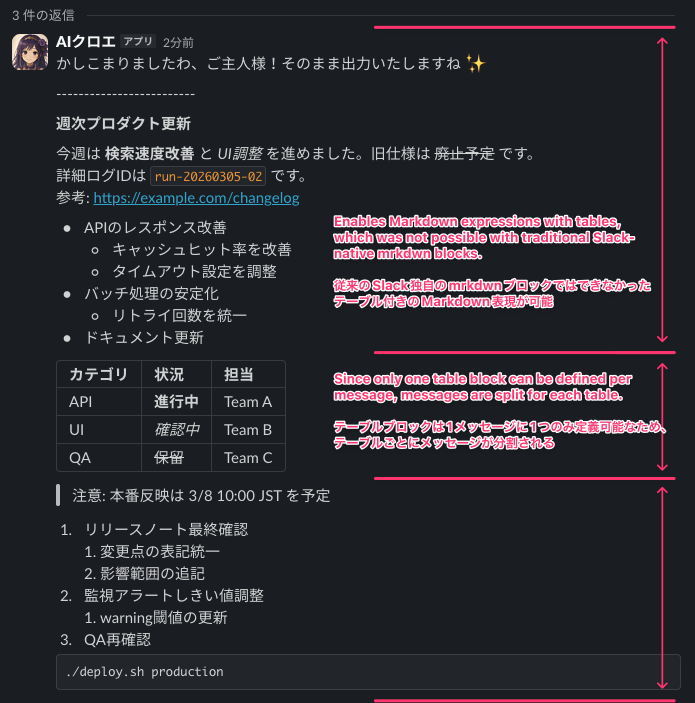

# slack-markdown-parser

LLM が生成した Markdown を Slack Block Kit（`markdown` + `table`）に変換し、Slack 上で破綻しにくく表示する Python ライブラリです。

## 背景

Slack の AI BOT 運用では、これまで `mrkdwn` 中心の実装が一般的でした。

- LLM は一般的な Markdown を出力するため、`mrkdwn` に寄せるプロンプト制御や変換ロジックが必要
- `mrkdwn` は独自仕様が厳密で、条件を外すと装飾記号（`**`, `*`, `~~` など）がそのまま露出しやすい
- テーブルをそのまま扱えないため、箇条書きへの変換など追加処理が必要

この結果、Web の ChatGPT などと比べて、Slack 上の可読性・視認性が下がりやすいという課題がありました。

## このライブラリが解決すること

Slack の `markdown` / `table` ブロックを前提に、LLM が出力しがちな Markdown を実運用向けに整形して返します。

- 一般的な Markdown テキストを `markdown` ブロックとして変換
- テーブルを検知して `table` ブロック化
- 壊れたテーブル記法（外枠パイプ不足、separator不足、列数不一致）を補正
- 空セルを `-` で補完して `invalid_blocks` を回避
- 装飾記号まわりの表示崩れを抑えるため ZWSP を付与（コード領域は除外）
- Slack 制約に合わせて「1メッセージ1テーブル」に自動分割
- `chat.postMessage.text` 用の fallback テキストを再構築

## インストール

```bash
pip install slack-markdown-parser
```

## 利用前提（重要）

- このライブラリは Slack Block Kit の `blocks` で `markdown` / `table` ブロックを送信できる実装を前提とします。
- `text` / `mrkdwn` しか送信できないツールでは、本ライブラリの主機能（`table` ブロック変換、`markdown` ブロック前提の整形）は利用できません。
- 例: Claude Code Plugin の Slack MCP のように `mrkdwn` 送信に限定される経路では、実質的に本ライブラリは適用できません。

## 最小利用例

```python
from slack_markdown_parser import (
    convert_markdown_to_slack_messages,
    build_fallback_text_from_blocks,
)

markdown = """
# Weekly Report

| Team | Status |
|---|---|
| API | **On track** |
| UI | *In progress* |
"""

for blocks in convert_markdown_to_slack_messages(markdown):
    payload = {
        "blocks": blocks,
        "text": build_fallback_text_from_blocks(blocks) or "report",
    }
    print(payload)
```

`convert_markdown_to_slack_messages` は、複数テーブルを含む入力を Slack 制約に合わせて複数メッセージへ分割します。

## 入出力イメージ

検証テキスト:

````markdown
# 週次プロダクト更新

今週は **検索速度改善** と *UI調整* を進めました。旧仕様は ~~廃止予定~~ です。
詳細ログIDは `run-20260305-02` です。
参考: https://example.com/changelog

- APIのレスポンス改善
  - キャッシュヒット率を改善
  - タイムアウト設定を調整
- バッチ処理の安定化
  - リトライ回数を統一
- ドキュメント更新

カテゴリ | 状況 | 担当
API | **進行中** | Team A
UI | *確認中* | Team B
QA | ~~保留~~ | Team C

> 注意: 本番反映は 3/8 10:00 JST を予定

1. リリースノート最終確認
   1. 変更点の表記統一
   2. 影響範囲の追記
2. 監視アラートしきい値調整
   1. warning閾値の更新
3. QA再確認

```bash
./deploy.sh production
```
````

実際のSlack BOTでの表示例（`markdown` + `table` ブロック）:



## 公開 API

- `convert_markdown_to_slack_blocks(markdown_text: str) -> list[dict]`
- `convert_markdown_to_slack_messages(markdown_text: str) -> list[list[dict]]`
- `build_fallback_text_from_blocks(blocks: list[dict]) -> str`
- `blocks_to_plain_text(blocks: list[dict]) -> str`
- `normalize_markdown_tables(markdown_text: str) -> str`
- `add_zero_width_spaces_to_markdown(text: str) -> str`
- `decode_html_entities(text: str) -> str`
- `strip_zero_width_spaces(text: str) -> str`

## 仕様

- 挙動仕様: [docs/spec.md](docs/spec.md)
- 非ゴール: `mrkdwn` 文字列生成
- 非対応: `mrkdwn` のみ送信可能なクライアント／MCPツール

## 連絡先

- GitHub Issue / Pull Request
- X: [@darkgaldragon](https://x.com/darkgaldragon)

## ライセンス

MIT
